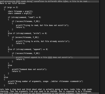

## Design with functions

As problems become more complex, so does the length of your code. Often this results in complex code with abundant nesting and walls of code. A result of incrementally adding new lines of code until most bugs are squashed and the problem is solved just before the deadline. In a sigh of relief you can hear yourself thinking: "it works, but..." Lets untangle the spaghetti and make that monstrous wall of code comprehensible again.   

## KISS: Keep It Stupid, Simple

Solve problems in a simple way. This is much easier said than done. In reality you are often solving multiple small problems at once that come together to form one big solution. The engineering challenge here is to discover these small problems, seperate them, and solve them independently. One way to do that is to break up your code in multiple functions that all do one thing (aka the S in SOLID, for the acronym-lovers).

For example, lets say we are building a program that prompts the user for input. Nevermind what we do with that input for now, but we probably need to check whether the input is valid. In other words, whatever the user enters is what we expect it to be. In case it is not, we better settle on a remedy, a big error or a re-prompt? Maybe there is some post-processing that needs doing, conversion to different data types, a file to be read... Here is our first version:

    if (argc == 3)
    {
        char* filename = argv[1];
        char* command = argv[2];

        if (strcmp(command, "read") == 0)
        {
            if (!access(filename, F_OK))
            {
                printf("Trying to read, but file does not exist!\n");
                return 1;
            }
        }
        else if (strcmp(command, "write") == 0)
        {
            if (access(filename, F_OK))
            {
                printf("Trying to write, but file already exists!\n");
                return 1;
            }
        }
        else if (strcmp(command, "append") == 0)
        {
            if (!access(filename, F_OK))
            {
                printf("Cannot append to a file that does not exist!\n");
                return 1;
            }
        }
        else
        {
            printf("Command does not exist\n");
            return 2;
        }
    }
    else
    {
        printf("Wrong number of arguments, usage: ./editor <filename> <command>\n")
        return 3;
    }

Lets take a step back and think about what is actually going on here. Looks like, argc needs checking. Then two arguments from argv need to be checked. One is supposed to be a filename, and that file needs to exist or not exist depending on the second argument. That second argument then needs to be one of three strings, it cannot be any other. Now back to the drawing table:

    validate_input
        - correct number of inputs?
        - second input is one of write, append, or read?
        - first input is a filename that exists in case of write/read or does not exist in case of write?

Each step here can be solved independently from each other, and can be solved in a simple way. Lets create a function for each step and refactor the code above:

    void validate_input(char** argv, int argc)
    {
        check_number_args(argc);
        check_command(argv[2]);
        check_filename(argv[1], argv[2]);
    }

    void check_number_args(int argc)
    {
        if (argc != 3)
        {
            printf("Wrong number of arguments, usage: ./editor <filename> <command>\n")
            exit(3);
        }
    }

    void check_command(char* command)
    {
        if (strcmp(command, "read") != 0 
            && strcmp(command, "write") != 0
            && strcmp(command, "append") != 0)
        {
            printf("Command does not exist\n");
            exit(2);
        }
    }

    void check_filename(char* filename, char* command)
    {
        bool file_exists = access(filename, F_OK);
        if (strcmp(command, "write") && file_exists)
        {
            printf("Trying to write, but file already exists!\n");
            exit(1);
        }
        else if (!file_exists)
        {
            printf("Trying to %s, but file does not exist!\n", command);
            exit(1);
        }
    }

Nothing clever, a short if-statement in a function checking each precondition for our program. Roughly the same number of lines of code, but no suprises and less cognitive load to parse the whole thing.

## Stupid

Cleverness is not always a good thing. You might be tempted to cram several lines of code in one compact ternary expression, to step into the world of pointer arithmatic to save an instruction or two, or to go all out playing [code golf](https://en.wikipedia.org/wiki/Code_golf). While it is fun and rewarding to discover and understand such things. It is much less fun having to understand such code while needing to add a new feature, change some behavior or fix that one unforeseen bug. So be kind to yourself in the future and to your fellow programmers, choose the stupid way of solving a problem over the clever way.

## DRY: Do not Repeat Yourself

While this also applies to smaller components, such as string literals and magic numbers, you should probably try to remove more repetition in your code. Copy-paste is easy, always available and probably in every initial piece of code you write. But having the same bits of code all over makes changing things and fixing bugs much harder. So lets do better! 

Take a look at your code, zoom out a bit, and squint your eyes. Do you see that pattern repeating itself?

Odds are you have the same bits of code in multiple places, solving the same problem over and over. Good oppurtunities for new functions. Try to spot the differences (if any) between the copies, those differences are your function parameters. Too many function parameters? Odds are the function you are trying to write is either too dependent on other parts of code, perhaps these other parts of code should move to the function too. Or the function you are trying to write does too many things at once. Try to find these things and break them apart in functions once again.
